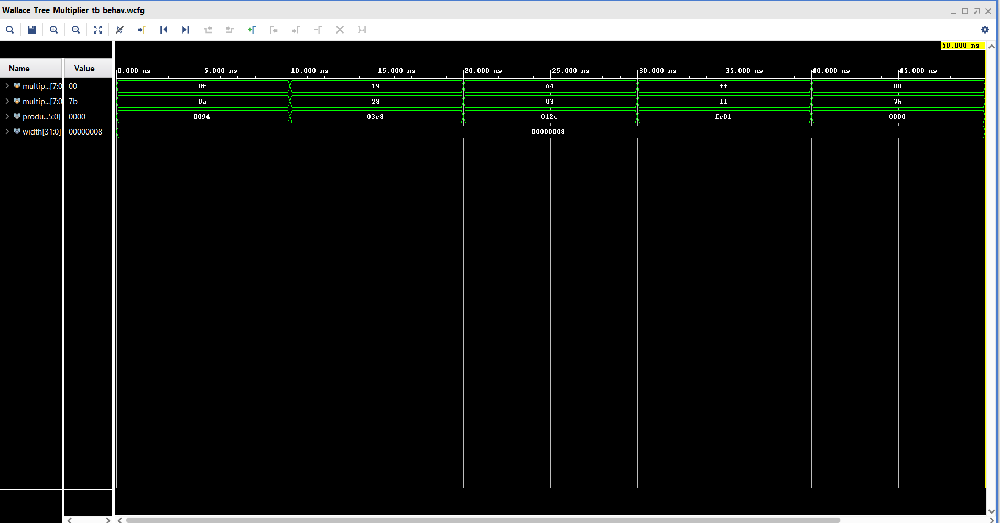

# Wallace Tree Multiplier - 8-bit

---

**Author**: Amaan Sami

---

## 📌 Project Description

- This repository contains the Verilog implementation of an **8-bit Wallace Tree Multiplier**.
- Wallace Tree architecture is used for fast multiplication by reducing the partial products efficiently in parallel stages.
- The multiplier takes two 8-bit unsigned inputs and produces a 16-bit product.

---

## 📂 Files Included

- `Wallace_Tree_Multiplier.v` — Verilog code for the main Wallace Tree Multiplier.
- `Wallace_Tree_Multiplier_tb.v` — Verilog testbench to verify the multiplier functionality.
- `Wallace_Tree_Reduction_diagram` — Diagram showing Wallace Tree reduction stages.
- `Wallace_Tree_Reduction_Test_Bench_Pic` — Simulation waveform output for verification.

---

## ⚙️ Features

- Fully parameterized multiplier (default width: 8-bit).
- Efficient Wallace Tree reduction using multiple levels of Half Adders and Full Adders.
- Modular and hierarchical code structure.
- Synthesizable Verilog code.
- Multiple test cases included for verification.

---

## 🧪 Test Cases

The design has been tested with the following input combinations:

| Multiplier | Multiplicand | Expected Product |
|-------------|---------------|-------------------|
| 15 | 10 | 150 |
| 25 | 40 | 1000 |
| 100 | 3 | 300 |
| 255 | 255 | 65025 |
| 0 | 123 | 0 |

---

## 🖥️ Simulation Results

### Wallace Tree Reduction Diagram

### Testbench Simulation Output

---

## 🚀 How to Run

1. Clone or download the repository.
2. Open the Verilog files in your preferred simulator (ModelSim / Questa / Vivado / etc.).
3. Compile and simulate `Wallace_Tree_Multiplier_tb.v`.
4. Observe simulation waveforms or console output for verification.

---

## 📈 Applications

- Digital Signal Processing (DSP)
- Arithmetic Logic Units (ALU)
- Graphics Processing Units (GPU)
- Embedded and High-Performance Computing

---

## 🔧 Future Improvements

- Extend multiplier width (16-bit / 32-bit implementations).
- Pipelining for higher clock frequency.
- Hybrid designs (Wallace + Booth combination).
- Full Synthesis and Layout (ASIC flow).

---

> *This project is part of my Verilog/VLSI design learning journey.*

