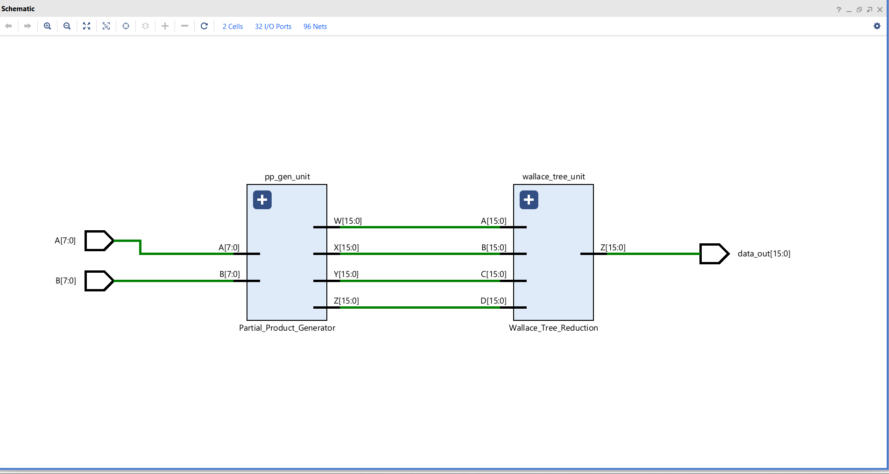

# 8-bit Radix-4 Booth + Wallace Tree Multiplier

This repository contains the SystemVerilog RTL implementation of a high-performance, 8-bit signed multiplier. The design is fully parallel and achieves single-cycle latency by combining Radix-4 Booth encoding with a Wallace tree reduction stage.

**Key Features:**  
- Engineered 8-bit signed multiplier in SystemVerilog, achieving single-cycle parallel latency.  
- Cut partial products by 50% with Radix-4 Booth encoding, reducing adder hardware.  
- Implemented 4:2 Wallace tree for logarithmic-time summation, minimizing critical path delay.  

**Architecture:**  
- **Partial Product Generator (`Partial_Product_Generator.v`)**  
  - The 8-bit multiplier Y is appended with a 0 and grouped into four 3-bit overlapping sets.  
  - Four parallel Radix-4 Booth Encoders (`booth_encoder_radix_4.v`) generate control signals for each set.  
  - These signals select the correct multiple of the multiplicand M (-2M, -M, 0, +M, +2M), resulting in only 4 partial products instead of 8.  

- **Wallace Tree Reduction (`Wallace_Tree_Reduction.v`)**  
  - The four 16-bit, sign-extended partial products are summed in parallel using a single 4:2 compressor stage.  
  - This tree uses `full_adder.v` and `half_adder.v` modules to reduce the 4 vectors down to 2 (Sum and Carry) in a single, fast combinational step.  

- **Final Adder**  
  - A standard 16-bit carry-propagate adder (`assign Z = X + Y;`) sums the final two vectors from the Wallace tree to produce the final 16-bit product.  

**Module Hierarchy:**  
booth_multiplier_top_module.sv
│
├── Partial_Product_Generator.sv
│ └── booth_encoder_radix_4.sv (x4)
│
└── Wallace_Tree_Reduction.sv
├── full_adder.sv (x16)
└── half_adder.sv (x3)

**Hardware Schematic:**  
- High-level schematic representing the architecture:  
  

**Testbench Simulation:**  
- Testbench for functional verification:  

- Example Test Case: `125 * -127` → checks multiplier output against a golden model and reports PASS/FAIL in the console.
